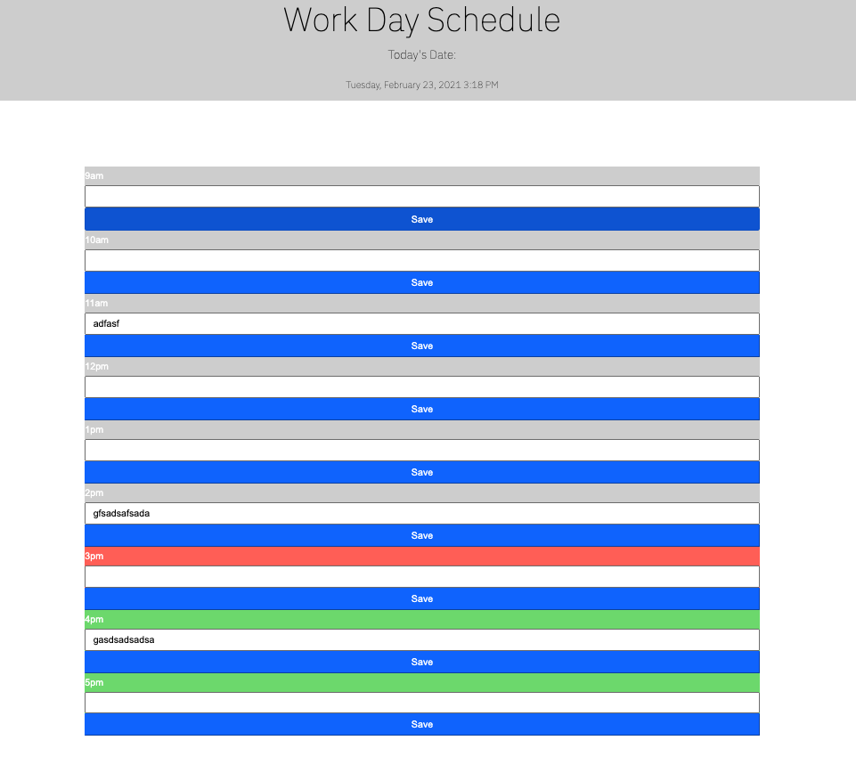

# calendar-schedule

AS AN employee with a busy schedule
YOU CAN ADD important events to a daily planner
SO THAT YOU can manage your time effectively

GIVEN YOU am using a daily planner to create a schedule
WHEN YOU open the planner
THEN the current day is displayed at the top of the calendar
WHEN YOU scroll down
THEN YOU am presented with timeblocks for standard business hours
WHEN YOU view the timeblocks for that day
THEN each timeblock is color coded to indicate whether it is in the past, present, or future
WHEN YOU click into a timeblock
THEN YOU can enter an event
WHEN YOU click the save button for that timeblock
THEN the text for that event is saved in local storage
WHEN YOU refresh the page
THEN the saved events persist

In the example below, when you open the page you can see the current date. As you continue strolling down you see the time slots from 9am to 12pm where you're able to add your itinerary for the day. If it's past the time the color will display gray, for current time it will display red, and for upcoming hours it will display green. Feel free to refresh the page and the text notated will remain. 

